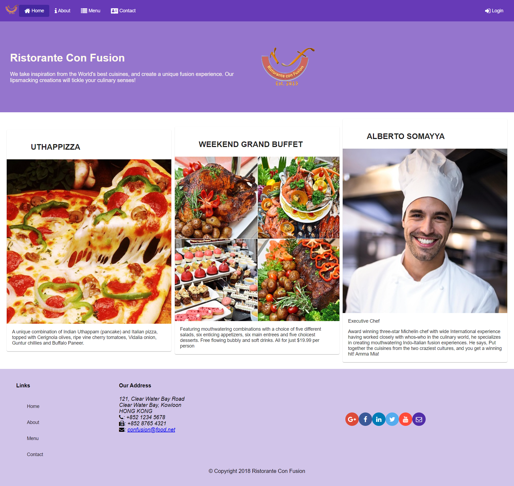
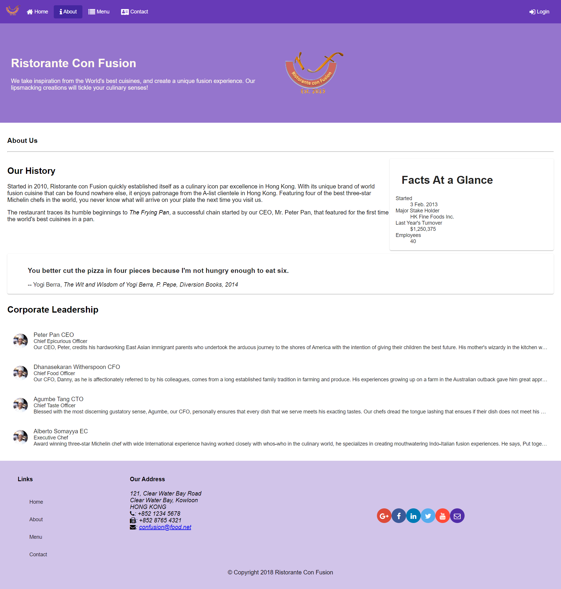

# angular_course
This project was done by me as a final assignment for Front-End JavaScript Frameworks: Angular course on Coursera.
___
**Theme**: Angluar application "Restourant ConFusion"\
**Main business process**: The project was created for clients
of restourant ConFusion to take look on menu and decide waht to order.
Also they can write comment for dishes in menu, send feedback and 
watch corporate leadership.

**Functions of client:**
* Watch menu of restourant
* Send feedback
* Write comments

## Technologies Used:
* Angular 14.1.0
* Node 16.16.0
* Bootstrap 4
* TypeScript 4.7.4

## Usage:
1. Clone this repository
2. json-server --watch db.json --port 3000

Then go to http://localhost:3000 in your browser

## Screenshots:
### Home

### About

### Menu

### Dish detail

### Contact

